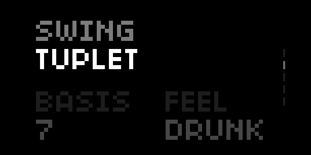

# Cyrene
A drummer in a box for the Norns sound computer.
Based on Mutable Instruments Grids by Émilie Gillet, Step by Anton Hörnquist (jah), and Playfair by tehn

Mutable Instruments Grids comes with 65,025 preset kick, snare, and hi-hat patterns (derived from the interpolation of 25 patterns). They are organized such that similar rhythms are positioned near each other in a two-dimentional grid, and the musician is able to select a position in that grid (and change that selection over time). In Cyrene, these rhythms are then fed into a sample based, monome grid-enabled step sequencer using the Ack engine, based originally on the Step script. There is also a euclidean trigger generator available for each track, based on Playfair by tehn.

## UI & Controls
* Change samples (and effects) via the params menu
* E1 controls page

### Landing page:

* E2 controls volume
* E3 controls tempo
* K2 stops playback, K3 resumes playback
* K2 while stopped resets pattern to the first beat

### Swing page:

* K2 and K3 cycle through the sections of the page
* On the first row:
  * E2 controls swing "type" (see below), either percentage-based or tuplet-based
  * If using percentage-based swing, E3 controls the swing percentage
* The second row is only available if using tuplet-based swing
  * E2 controls the tuplet basis
  * E3 controls the "feel" (see below)

So what are the swing "types" and "feels"? The two swing types are "percentage-based" and "tuplet-based".

Percentage-based swing is a common setting on most drum machines: the beat is divided evenly by default (in Cyrene, is called "0%"), and as you dial up the percentage, the beat is divided unevenly as per your percentage selection (in Cyrene, this is scaled to max out at 7/8ths of a beat at "100%"). This algorithm either runs as "8th note swing" (making 8th notes uneven but leaving quarter notes alone), or "16th note swing" (making 16th notes uneven but leaving 8th notes alone).

Tuplet-based swing in Cyrene is different. Rather than making two-note pairs at the 8th- or 16th-note level unevenly split, it re-divides the whole beat into N equal parts (a "tuplet"), then spreads out the triggers differently across those N equal parts according to different rules (called "feels"). For example, with a 7-tuplet "drunk" feel, each beat is subdivided as 2-2-2-1. With a 9-tuplet "clave" feel, every 2 beats is divided as 2-3-2-2 3-2-2-2 (or, more idiomatically for clave, 2-3-2 2-3-2 2-2). With 6 different tuples and 4 different feels, you have 24 different ways to spice up your rhythms in ways that you just can't get with most drum machines.

### Pattern & Density page:

* K2 and K3 cycle through the sections of the page
* E2 & E3 control selected values (X/Y, Kick/Snare density, Hat density/Chaos)

### More Densities page:
* K2 and K3 cycle through the sections of the page
* E2 & E3 control selected values (densities for tracks 4 thru 7)

### Euclidean page:
[Euclidean Rhythms](https://en.wikipedia.org/wiki/Euclidean_rhythm)
* K2 and K3 cycle through the tracks
* E2 controls euclidean fill
* E3 controls euclidean length
* K2+E2 controls euclidean rotation
* K2+E3 to enable/disable euclidean mode for the highlighted track
  * While euclidean mode is disabled, editing the euclidean settings has no effect
  * When turning euclidean mode from on to off, the kick, snare, and hi-hat tracks go back to their MI Grids patterns based on the current X/Y settings

### Grid (optional)
* Each row is a track, with the first 3 being kick, snare, and hi-hat respectively
  * You can, of course, assign any sample to these tracks. But these are the tracks controlled by the Grids patterns, which were designed to control those specific instruments
* Each column is a beat in the sequence
* Clicking a key toggles whether or not the sample for that track will play on that beat
* Click on the last row jumps playback to the beat matching the clicked column
* Bottom right key is an alt key, hold to enter alt mode
  * Bottom left now shows page indicators: bright for current page, faded for inactive pages. Click an inactive page to switch to that page of the grid. Only relevant if you have a sequence length longer than your grid is wide
  * Click any track (rows 1-7) to enter probability editing mode for that track. Y axis now shows probability of a trigger firing on that step. Pagination works as usual, and you can click the key to the left of the alt key to go back to the default multi-track view

### Arc (optional)
* Use the params page under "Arc" to control which encoder controls which parameter
* Defaults:
  * Encoder 1 controls tempo
  * Encoder 2 controls swing amount (for percentage-based swing)
  * Encoder 3 controls pattern X
  * Encoder 4 controls pattern Y

### Crow (optional)
* Editable from the params menu:
  * Cyrene track associated with each output
  * Output mode (gate, envelope, or disabled)
  * Each output's attack and release when in envelope mode
  * The param modulated by each input voltage

## Requirements
* norns
* the Ack engine
* grid optional but encouraged (varibright especially, 8 or 16 wide)
* arc optional
* crow optional

## Roadmap
* Performable track mutes (likely using the grid interface)
* Multi-sample mode: use multiple samples on the same track (e.g. two slightly different kick drums) for more realism
* Improvements to the quantized "cuts" feature
