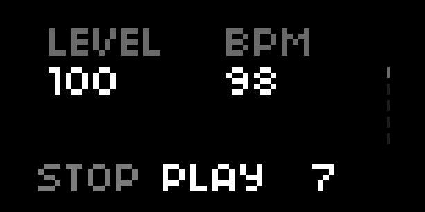

# Cyrene
A drummer in a box for the Norns sound computer.
Based on Mutable Instruments Grids by Émilie Gillet and Step by Anton Hörnquist (jah)

Mutable Instruments Grids comes with 65,025 preset kick, snare, and hi-hat patterns (derived from the interpolation of 25 patterns). They are organized such that similar rhythms are positioned near each other in a two-dimentional grid, and the musician is able to select a position in that grid (and change that selection over time). In Cyrene, these rhythms are then fed into a rather direct port of Step for norns, which is a sample based, monome grid-enabled step sequencer using the Ack engine.

## UI & Controls
* Change samples (and effects) via the params menu
* E1 controls page

### Landing page:

* E2 controls tempo
* E3 controls swing
* K2+E2 controls volume
* K2 stops playback, K3 resumes playback
* K2 while stopped resets pattern to the first beat

### Pattern & Density page:

* K2 and K3 cycle through the sections of the page
* E2 & E3 control selected values (X/Y, Kick/Snare density, Hat density/Chaos)

### More Densities page:
* K2 and K3 cycle through the sections of the page
* E2 & E3 control selected values (densities for tracks 4 thru 7)

### Euclidean page:
[Euclidean Rhythms](https://en.wikipedia.org/wiki/Euclidean_rhythm)
* K2 and K3 cycle through the tracks
* E2 controls euclidean fill
* E3 controls euclidean length
* K2+E2 controls euclidean rotation
* K2+E3 to enable/disable euclidean mode for the highlighted track
  * While euclidean mode is disabled, editing the euclidean settings has no effect
  * When turning euclidean mode from on to off, the kick, snare, and hi-hat tracks go back to their MI Grids patterns based on the current X/Y settings

### Grid (optional)
* Each row is a track, with the first 3 being kick, snare, and hi-hat respectively
* Each column is a beat in the sequence
* Clicking a key toggles whether or not the sample for that track will play on that beat
* Click on the last row jumps playback to the beat matching the clicked column
* Bottom right key is an alt key, hold to enter alt mode
  * Bottom left now shows page indicators: bright for current page, faded for inactive pages. Click an inactive page to switch to that page of the grid. Only relevant if you have a sequence length longer than your grid is wide
  * Click any track (rows 1-7) to enter probability editing mode for that track. Y axis now shows probability of a trigger firing on that step. Pagination works as usual, and you can click the key to the left of the alt key to go back to the default multi-track view

### Arc (optional)
  * Encoder 1 controls tempo
  * Encoder 2 controls swing

### Crow (optional)
  * Editable from the params menu:
    * Cyrene track associated with each output
    * Each output's attack and release envelope
    * The param modulated by each input voltage

## Requirements
* norns
* the Ack engine
* grid optional but encouraged (varibright especially, 8 or 16 wide)
* arc optional
* crow optional

## Roadmap
* Hold K2 and tap K3 for tap tempo
* Velocity / different volumes / MI Grids-style "accent" support
* Multi-sample mode: use multiple samples on the same track (e.g. two slightly different kick drums) for more realism
